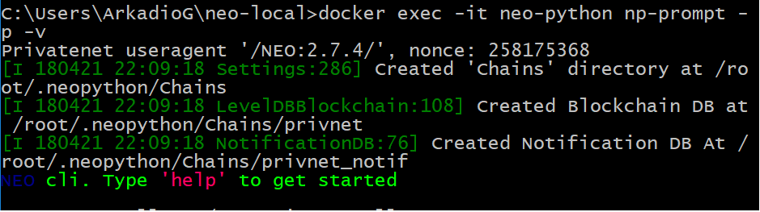

# neo-local installing on Windows

1. clone repository **neo-local** to some folder:  
    `git clone https://github.com/neoauth/neo-local.git`

1. change dir into repository:  
    `cd /neo-local`
    
1. run command:  
    `docker-compose up -d --build --remove-orphans --force-recreate`  
    wait untill all components are installed.

1. launch **neo-python**:  
    `docker exec -it neo-python np-prompt -p -v`  
    command line should look similar to that:  
    
    
 
1. To stop all containers run command
    * in command line: `docker-compose down > NUL`
    * in powershell: `docker-compose down > $null`
 
 #### [Next Step - openning wallet](wallet.md) 